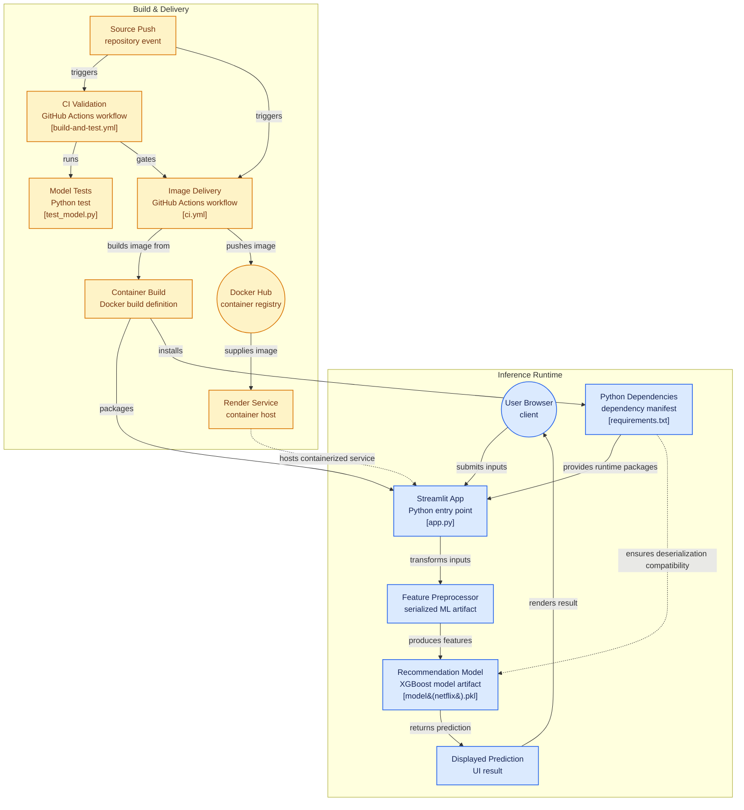

# Repository Architecture

```mermaid
flowchart TD

subgraph group_inference["Inference Runtime"]
  node_browser(("User Browser<br/>client"))
  node_streamlit_app["Streamlit App<br/>Python entry point<br/>[app.py]"]
  node_preprocessor["Feature Preprocessor<br/>serialized ML artifact"]
  node_model["Recommendation Model<br/>XGBoost model artifact<br/>[model&#40;netflix&#41;.pkl]"]
  node_prediction["Displayed Prediction<br/>UI result"]
  node_dependencies["Python Dependencies<br/>dependency manifest<br/>[requirements.txt]"]
end

subgraph group_delivery["Build &amp; Delivery"]
  node_dockerfile["Container Build<br/>Docker build definition"]
  node_source_push["Source Push<br/>repository event"]
  node_ci_workflow["CI Validation<br/>GitHub Actions workflow<br/>[build-and-test.yml]"]
  node_delivery_workflow["Image Delivery<br/>GitHub Actions workflow<br/>[ci.yml]"]
  node_model_test["Model Tests<br/>Python test<br/>[test_model.py]"]
  node_docker_hub(("Docker Hub<br/>container registry"))
  node_render["Render Service<br/>container host"]
end

node_browser -->|"submits inputs"| node_streamlit_app
node_streamlit_app -->|"transforms inputs"| node_preprocessor
node_preprocessor -->|"produces features"| node_model
node_model -->|"returns prediction"| node_prediction
node_prediction -->|"renders result"| node_browser
node_dependencies -->|"provides runtime packages"| node_streamlit_app
node_dependencies -.->|"ensures deserialization compatibility"| node_model
node_dockerfile -->|"packages"| node_streamlit_app
node_dockerfile -->|"installs"| node_dependencies
node_source_push -->|"triggers"| node_ci_workflow
node_ci_workflow -->|"runs"| node_model_test
node_ci_workflow -->|"gates"| node_delivery_workflow
node_source_push -->|"triggers"| node_delivery_workflow
node_delivery_workflow -->|"builds image from"| node_dockerfile
node_delivery_workflow -->|"pushes image"| node_docker_hub
node_docker_hub -->|"supplies image"| node_render
node_render -.->|"hosts containerized service"| node_streamlit_app

click node_streamlit_app "https://github.com/cnadupuri/netflix-recommender-ml/blob/main/app.py"
click node_preprocessor "https://github.com/cnadupuri/netflix-recommender-ml/blob/main/preprocessor(netflix).pkl"
click node_model "https://github.com/cnadupuri/netflix-recommender-ml/blob/main/model(netflix).pkl"
click node_dependencies "https://github.com/cnadupuri/netflix-recommender-ml/blob/main/requirements.txt"
click node_dockerfile "https://github.com/cnadupuri/netflix-recommender-ml/blob/main/Dockerfile"
click node_ci_workflow "https://github.com/cnadupuri/netflix-recommender-ml/blob/main/.github/workflows/build-and-test.yml"
click node_delivery_workflow "https://github.com/cnadupuri/netflix-recommender-ml/blob/main/.github/workflows/ci.yml"
click node_model_test "https://github.com/cnadupuri/netflix-recommender-ml/blob/main/test_model.py"

classDef toneNeutral fill:#f8fafc,stroke:#334155,stroke-width:1.5px,color:#0f172a
classDef toneBlue fill:#dbeafe,stroke:#2563eb,stroke-width:1.5px,color:#172554
classDef toneAmber fill:#fef3c7,stroke:#d97706,stroke-width:1.5px,color:#78350f
classDef toneMint fill:#dcfce7,stroke:#16a34a,stroke-width:1.5px,color:#14532d
classDef toneRose fill:#ffe4e6,stroke:#e11d48,stroke-width:1.5px,color:#881337
classDef toneIndigo fill:#e0e7ff,stroke:#4f46e5,stroke-width:1.5px,color:#312e81
classDef toneTeal fill:#ccfbf1,stroke:#0f766e,stroke-width:1.5px,color:#134e4a
class node_browser,node_streamlit_app,node_preprocessor,node_model,node_prediction,node_dependencies toneBlue
class node_dockerfile,node_source_push,node_ci_workflow,node_delivery_workflow,node_model_test,node_docker_hub,node_render toneAmber
```
