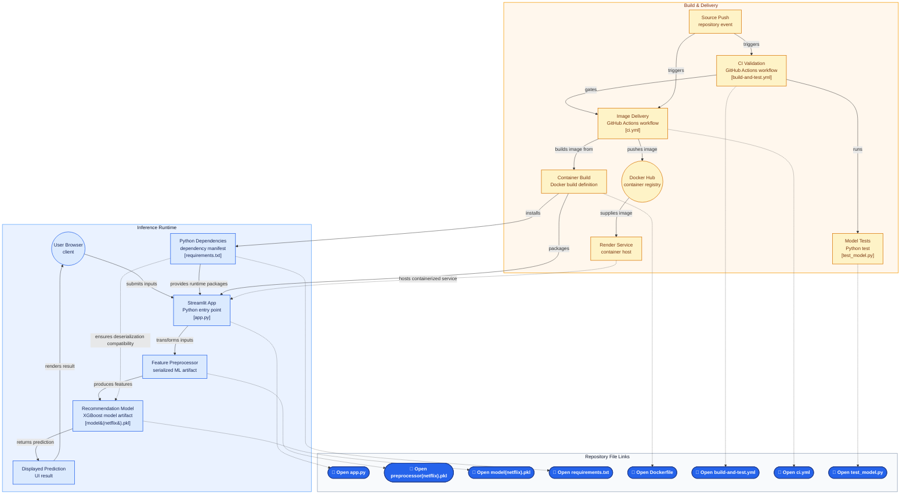

# Repository Architecture

```mermaid
flowchart TD

subgraph group_inference["Inference Runtime"]
  node_browser(("User Browser<br/>client"))
  node_streamlit_app["Streamlit App<br/>Python entry point<br/>[app.py]"]
  node_preprocessor["Feature Preprocessor<br/>serialized ML artifact"]
  node_model["Recommendation Model<br/>XGBoost model artifact<br/>[model&#40;netflix&#41;.pkl]"]
  node_prediction["Displayed Prediction<br/>UI result"]
  node_dependencies["Python Dependencies<br/>dependency manifest<br/>[requirements.txt]"]
end

subgraph group_delivery["Build &amp; Delivery"]
  node_dockerfile["Container Build<br/>Docker build definition"]
  node_source_push["Source Push<br/>repository event"]
  node_ci_workflow["CI Validation<br/>GitHub Actions workflow<br/>[build-and-test.yml]"]
  node_delivery_workflow["Image Delivery<br/>GitHub Actions workflow<br/>[ci.yml]"]
  node_model_test["Model Tests<br/>Python test<br/>[test_model.py]"]
  node_docker_hub(("Docker Hub<br/>container registry"))
  node_render["Render Service<br/>container host"]
end

subgraph group_links["Repository File Links"]
  link_app(["🔗 Open app.py"])
  link_preprocessor(["🔗 Open preprocessor(netflix).pkl"])
  link_model(["🔗 Open model(netflix).pkl"])
  link_requirements(["🔗 Open requirements.txt"])
  link_dockerfile(["🔗 Open Dockerfile"])
  link_ci(["🔗 Open build-and-test.yml"])
  link_delivery(["🔗 Open ci.yml"])
  link_tests(["🔗 Open test_model.py"])
end

node_browser -->|"submits inputs"| node_streamlit_app
node_streamlit_app -->|"transforms inputs"| node_preprocessor
node_preprocessor -->|"produces features"| node_model
node_model -->|"returns prediction"| node_prediction
node_prediction -->|"renders result"| node_browser
node_dependencies -->|"provides runtime packages"| node_streamlit_app
node_dependencies -.->|"ensures deserialization compatibility"| node_model
node_dockerfile -->|"packages"| node_streamlit_app
node_dockerfile -->|"installs"| node_dependencies
node_source_push -->|"triggers"| node_ci_workflow
node_ci_workflow -->|"runs"| node_model_test
node_ci_workflow -->|"gates"| node_delivery_workflow
node_source_push -->|"triggers"| node_delivery_workflow
node_delivery_workflow -->|"builds image from"| node_dockerfile
node_delivery_workflow -->|"pushes image"| node_docker_hub
node_docker_hub -->|"supplies image"| node_render
node_render -.->|"hosts containerized service"| node_streamlit_app

node_streamlit_app -.-> link_app
node_preprocessor -.-> link_preprocessor
node_model -.-> link_model
node_dependencies -.-> link_requirements
node_dockerfile -.-> link_dockerfile
node_ci_workflow -.-> link_ci
node_delivery_workflow -.-> link_delivery
node_model_test -.-> link_tests

click link_app "https://github.com/cnadupuri/netflix-recommender-ml/blob/main/app.py" "Open Streamlit application"
click link_preprocessor "https://github.com/cnadupuri/netflix-recommender-ml/blob/main/preprocessor(netflix).pkl" "Open feature preprocessor"
click link_model "https://github.com/cnadupuri/netflix-recommender-ml/blob/main/model(netflix).pkl" "Open recommendation model"
click link_requirements "https://github.com/cnadupuri/netflix-recommender-ml/blob/main/requirements.txt" "Open dependencies"
click link_dockerfile "https://github.com/cnadupuri/netflix-recommender-ml/blob/main/Dockerfile" "Open Dockerfile"
click link_ci "https://github.com/cnadupuri/netflix-recommender-ml/blob/main/.github/workflows/build-and-test.yml" "Open validation workflow"
click link_delivery "https://github.com/cnadupuri/netflix-recommender-ml/blob/main/.github/workflows/ci.yml" "Open delivery workflow"
click link_tests "https://github.com/cnadupuri/netflix-recommender-ml/blob/main/test_model.py" "Open model tests"

classDef toneBlue fill:#dbeafe,stroke:#2563eb,stroke-width:1.5px,color:#172554
classDef toneAmber fill:#fef3c7,stroke:#d97706,stroke-width:1.5px,color:#78350f
classDef toneButton fill:#2563eb,stroke:#1e3a8a,stroke-width:2px,color:#ffffff,font-weight:bold
class node_browser,node_streamlit_app,node_preprocessor,node_model,node_prediction,node_dependencies toneBlue
class node_dockerfile,node_source_push,node_ci_workflow,node_delivery_workflow,node_model_test,node_docker_hub,node_render toneAmber
class link_app,link_preprocessor,link_model,link_requirements,link_dockerfile,link_ci,link_delivery,link_tests toneButton
style group_inference fill:#eaf2ff,stroke:#60a5fa,stroke-width:1.5px,color:#0f172a
style group_delivery fill:#fff7ed,stroke:#f59e0b,stroke-width:1.5px,color:#7c2d12
style group_links fill:#f8fafc,stroke:#94a3b8,stroke-width:1.5px,color:#0f172a
```
